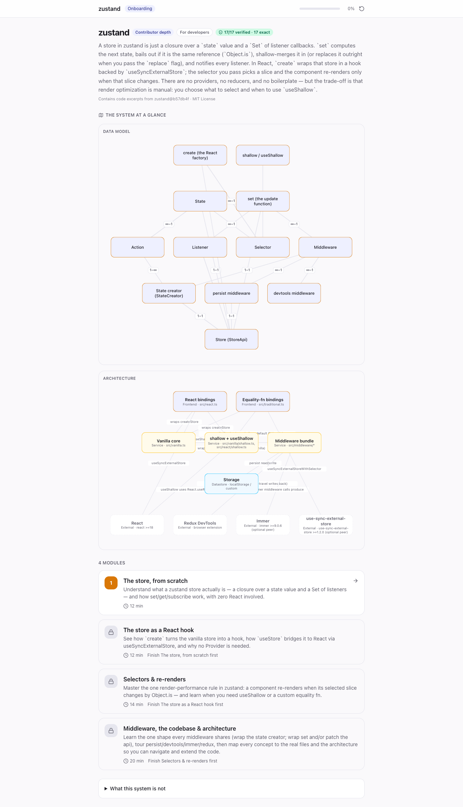
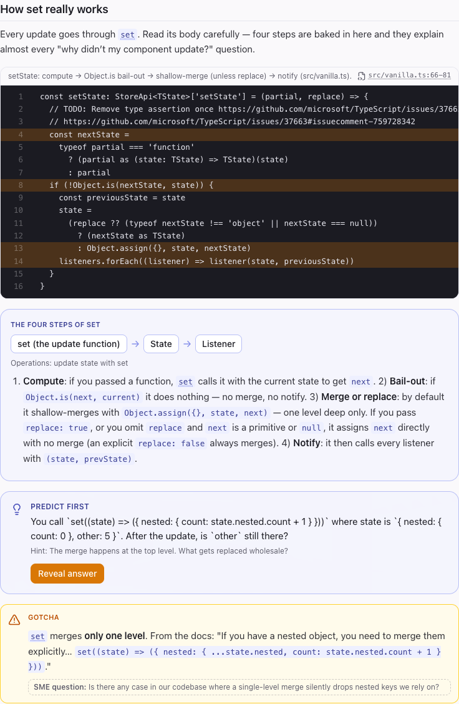

# system-explainer

**Onboard to any codebase with a course that proves itself.**

system-explainer teaches how an unfamiliar software system really works, generates an interactive onboarding course from a repository, and then proves the course is true: every snippet is checked against the source, every claim is attacked by a skeptic, and a simulated learner has to pass the quiz. Nobody else verifies the explanation; this tool ships the proof with the course.

[**Live demo: the zustand course**](https://shaheershoaib.github.io/system-explainer/) · [**Its proof report**](onboarding-template/proof-runs/zustand/PROOF_REPORT.md) · [Install](#install) · [Architecture](docs/architecture.md)



## Why it exists

The usual failure when explaining a system is **industry-prior leakage**: the explainer describes how systems of that type normally work rather than how *this one* does, and the learner cannot tell the difference. The second failure is unearned confidence: a course that reads beautifully and is quietly wrong.

So the method is built around observation rather than recall. A grounding pass reads the real artifacts with fresh eyes and returns verbatim quotes with a names ledger; every code snippet in a generated course is matched against source, line for line; a skeptic tries to refute every prose claim; and a learner is simulated to test whether the teaching actually teaches.

## What you get

| Job | What it produces | Where |
|---|---|---|
| **Teach** | A conversation that builds a concept-first mental model, validates it by making you restate it, stress-tests it, and grounds it in the real files, screens or endpoints. Persists a knowledge base you can commit. Works on a codebase, an API, infrastructure, or a live tool whose only "source" is a canvas or admin UI. | [`SKILL.md`](SKILL.md) |
| **Generate** | A standalone interactive course: concept lessons, diagrams derived from the data model, quizzes built from a misconception bank, branching simulations with a live ledger, annotated real screens, spaced review, a lead dashboard. One engine, a validated data bundle per system. Hand-authored from a knowledge base, or autonomously from a cold repo in one command. | [`references/course-generation.md`](references/course-generation.md), [`onboarding-template/`](onboarding-template/) |
| **Prove** | A proof report on three layers: **faithful** (snippet = source, line-exact), **true** (each claim survives an adversarial refuter), **effective** (a learner who read the module beats a cold control on a hardened quiz). Plus `reverify`, which re-runs the grounding gate on every commit and fails when the repo drifts past the course. | [`onboarding-template/generator/`](onboarding-template/generator/) |

## See it: the flagship course

The bundled course teaches [zustand](https://github.com/pmndrs/zustand), a real public codebase, so the whole pipeline is demonstrable end to end without any private material.

The proof pipeline was run on it before this release, and the run is committed under [`onboarding-template/proof-runs/zustand/`](onboarding-template/proof-runs/zustand/) (inputs, verdicts with file:line evidence, hardened quiz, learner answers, report).

**Layer 1, faithful:** 17 of 17 code snippets are contiguous verbatim copies of `zustand@b57db4f`; each deep-links to its exact lines.

**Layer 2, true:** the first adversarial pass on the hand-authored course refuted 13 of 113 atomic claims and could not verify 3 more, even though every snippet had passed grounding. They were real errors: the `set` walkthrough ignored the `replace` flag, the v5 fresh-object-selector failure was described with v4's symptom, immer was said not to patch `store.setState` (it does), devtools was called inspection-only (it writes state on time travel), the curried `create` was said to infer the state type (it infers the middleware list), "exactly three externals" (there are at least five). The course was corrected against the evidence and re-attacked until nothing was left to refute:

| adversarial round | atomic claims | supported | refuted | unverifiable |
|---|---|---|---|---|
| 1 (course as first published) | 113 | 97 | 13 | 3 |
| 2 | 149 | 142 | 3 | 4 |
| 3 | 152 | 148 | 1 | 3 |
| final | 155 | 155 | 0 | 0 |

Every round's verdicts are kept under [`proof-runs/zustand/rounds/`](onboarding-template/proof-runs/zustand/rounds/). The classes of error the skeptic found are now an authoring checklist in the skill itself.

**Layer 3, effective:** a null result on this repo, and the report says so. A fresh 4-option quiz per module (20 items, distractors drawn from real-but-wrong neighbours) was answered by a learner that had read the module and by a cold control that saw only the quiz. Both scored 100%: the control already knew zustand, so no item discriminated and the measured lift is 0. The harness fires its high-cold-control caveat automatically instead of reporting a flattering number. Lift is the instrument for private and internal codebases, where a control cannot have priors; on a famous public library the faithful and true layers carry the evidence. Full report: [`PROOF_REPORT.md`](onboarding-template/proof-runs/zustand/PROOF_REPORT.md).

When zustand moved past the commit the course was first verified against, `reverify` mapped the 18 changed upstream files to the 3 modules that cite them and re-ran the gate in seconds:

```
reverify zustand: 18 file(s) changed since a1f685c
  3 module(s) cite changed files:
   • react-binding ("The store as a React hook") — 1 block(s): README.md
   • selectors-rerenders ("Selectors & re-renders") — 1 block(s): README.md
   • middleware-and-code ("Middleware, the codebase & architecture") — 4 block(s): README.md, docs/reference/middlewares/persist.md, src/middleware/immer.ts, src/middleware/persist.ts
  grounding @ HEAD: 17/17 verified
```

CI runs the same check against the pinned upstream commit on every push, so the "verified against" badge cannot rot silently.



## Quickstart

### Learn a system

Install the skill (below), open the repo you want to understand, and ask:

> Explain this system to me. Start from the outside: who are the actors and what is its one job?

The skill will configure a knowledge base, build a mental model with you, make you restate it, ground it in the real artifacts, and log every non-obvious behaviour it finds to `gotchas.md`. Ask "and where in the code is that handled?" to switch to walkthrough mode.

### Generate a course from a repo

In Claude Code, inside the repo:

> Course this repo for new developers.

The skill runs the autonomous loop (enumerate domains, extract the data model, author a module per domain, verify every snippet against source, check completeness), assembles and validates the bundle, and runs the proof workflow. The course lands as `bundle.json`; `npm run export` in the engine turns it into a static site anyone can open.

### Prove a course

> Prove the course. Refute anything you can.

Produces `proof-runs/<system>/PROOF_REPORT.md` with the three layers above and an explicit list of the claims that did not survive.

### Run the engine locally

```bash
cd onboarding-template
npm install
npm run generate -- --system zustand --repo /path/to/zustand   # bundle + grounding record
npm run dev                                                    # the course at http://localhost:5174
npm test && npm run typecheck                                  # 111 tests
```

## Install

**Claude Code plugin** (also registers the knowledge-base MCP server and the compaction hook):

```
/plugin marketplace add shaheershoaib/system-explainer
/plugin install system-explainer@system-explainer
```

**Any agent that reads skills** (Claude Code, Codex, Cursor, Copilot, Gemini CLI and others, via [skills.sh](https://skills.sh)):

```bash
npx skills add shaheershoaib/system-explainer -g
```

**Manual:** clone the repo anywhere your agent loads skills from; paths inside the skill resolve relative to its own directory. Knowledge bases are written outside the skill, to `~/.system-explainer/references/` by default or to `<repo>/.system-explainer/references/` when that directory exists (commit it to share the knowledge base with your team). Node 20 or newer for the engine.

## How it compares

Several excellent tools explain a repository. As far as their public READMEs describe, none of them verifies the explanation against the source or measures whether it teaches.

| | system-explainer | Understand-Anything | codebase-to-course | DeepWiki |
|---|---|---|---|---|
| Explains a repo | interactive course + conversational teaching | knowledge graph, dashboard, tours | single-page HTML course | hosted wiki |
| Snippets verified against source | line-exact, re-verified in CI | no | no | no |
| Prose claims adversarially checked | yes, with evidence per claim | no | no | no |
| Teaching measured | taught vs cold control, per item | no | no | no |
| Teaches systems with no repo (canvas, admin UI) | yes | no | no | no |
| Install | Claude Code plugin, skills.sh | plugin, many agents | Claude Code skill | hosted |

Corrections welcome; open an issue.

## Architecture in one paragraph

Two contracts, many consumers. The **knowledge base** is markdown (`one-job`, `actors`, `entities` with a verbatim names ledger, `verbs`, `trace`, `gotchas`, `learning-log`), written by the teaching skill through a schema-enforcing MCP server. The **bundle** is JSON validated by a zod schema (actors, entities with cardinality, modules of typed blocks, quizzes with misconception ids, a grounding record pinned to a commit). The engine renders any bundle and knows nothing about the system it teaches; the proof harness scores any bundle. Full tour: [`docs/architecture.md`](docs/architecture.md).

## Roadmap

- **Standalone `npx system-explainer course <repo>`** with your own API key, so the autonomous loop runs outside Claude Code. The prompts are already data in `onboarding-template/generator/*.workflow.js`.
- A hosted gallery: paste a repo URL, get a course and its proof.
- A cross-model adversarial pass, so the skeptic does not share the author's blind spots, and a cold control drawn from a model that has not memorized the repo, so Layer 3 can discriminate on famous public codebases too.

## Contributing

See [`CONTRIBUTING.md`](CONTRIBUTING.md). Two invariants: the engine is system-agnostic, and the skill keys on properties of a system, never on products.

## License

[Apache 2.0](LICENSE): free to use, modify, and share, including commercially. Keep the [`NOTICE`](NOTICE) file with any redistribution (§4(d)), and don't market a fork under the `system-explainer` name (§6). The patent grant in §3 means adopting this doesn't expose you to a patent claim over it.

Required Notice: Copyright Shaheer Shoaib (https://github.com/shaheershoaib)
