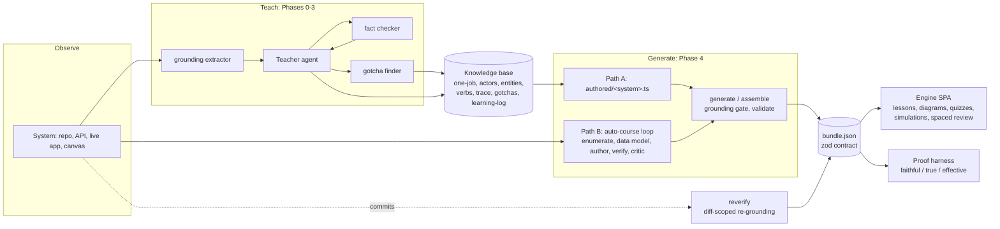

# Architecture

system-explainer has two jobs and one source of truth. The **teaching skill** (`SKILL.md`) builds a
knowledge base about a system while teaching a person; the **course engine** (`onboarding-template/`)
renders a course from a validated content bundle; the **proof harness** checks that the course is
faithful to the source, true under adversarial reading, and effective at teaching. Everything the
skill learns and everything the engine renders passes through one of two data contracts: the
knowledge base (markdown) and the bundle (JSON).

## Components

| Path | What it is | Runs where |
|---|---|---|
| `SKILL.md` | The teaching method (Phases 0-3) and the entry point for course generation. | Any agent runtime that loads skills. |
| `subagents/*.md` | Three read-only prompts the teacher dispatches: grounding extractor (Step 0), fact checker (Step 6.5), gotcha finder (Step 7). | Dispatched as read-only subagents. |
| `references/course-generation.md` | The full Phase 4 procedure (audience, depth, authoring, the two generation paths, the proof gate). Loaded only when a course is requested. | Read on demand. |
| `mcp/teaching-knowledge-base/` | A dependency-free MCP server that enforces the schema of every append to `gotchas.md`, `learning-log.md`, and `context-index.md`. | Registered by `.mcp.json` when installed as a plugin, or manually. |
| `hooks/` | A PreCompact hook that stamps a compaction marker into each recently active knowledge base, so a re-engaging session knows to re-read from disk. | Claude Code hook. |
| `onboarding-template/schema/bundle.ts` | The bundle contract. zod is the single source of truth; the TypeScript types are inferred from it. | Build time and run time (the SPA re-validates the bundle it loads). |
| `onboarding-template/generator/` | `cli.ts` (Path A: authored module to bundle), `assemble-bundle.ts` (Path B: work directory to bundle), `verify-grounding.ts` (snippet vs source), `reverify.ts` (diff-scoped re-grounding), `proof.ts` (the deterministic half of the proof), and the two Workflow scripts that orchestrate the LLM halves. | Node 20+. |
| `onboarding-template/src/` | The learner SPA. 100% data-driven; nothing in it knows which system it is teaching. | Browser. |
| `onboarding-template/server/` | Optional progress sync and lead dashboard (Express, JSON file store). | Node, only if a team dashboard is wanted. |

## The two contracts

**Knowledge base.** One directory per system holding `context-index.md`, `one-job.md`, `actors.md`,
`entities.md`, `verbs.md`, `trace.md`, `navigation.md`, `gotchas.md`, `learning-log.md`, and a
`context/` folder. Every entity carries a verbatim `label:` plus a locator (the names ledger), a
`whySeparate:` boundary rationale, and a provenance tag (`observed` / `specified` / `inferred`).
`gotchas.md` and `learning-log.md` are append-only.

Where the knowledge base lives (`<kb-root>`), in order of precedence:

1. `$SYSTEM_EXPLAINER_HOME/references` when the variable is set.
2. `<git root>/.system-explainer/references` when that directory exists (a project-local knowledge
   base that can be committed and shared with the team).
3. `~/.system-explainer/references` otherwise.

Knowledge bases created by versions before 3.0 under `~/.claude/skills/system-explainer/references/`
keep working in place; the skill, the MCP server, and the hook all check that legacy location per
system and never migrate silently.

**Bundle.** `system` (one-liner, pitch, audience, depth, repo URL), `actors[]` (context diagram),
`entities[]` with cardinality (ER diagram), optional `verbs[]`, `flows[]`, `simulations[]`,
`screens[]`, `architecture`, `glossary[]`, and `modules[]`. A module has ordered `lessons[]` of typed
blocks (`prose`, `mental-model`, `predict-reveal`, `diagram`, `code`, `worked-example`, `callout`,
`simulation`, `screen`, `code-map`, `decisions`, `sources`, `exercise`) and a `quiz[]` (`mcq`,
`ordering`, `short-answer`, `spot-bug`). MCQ and spot-bug items carry a `misconception {id, trap,
correction}`; that id is the unit the dashboard aggregates and the unit spaced review schedules.
`provenance.grounding` records the repo commit the snippets were verified against and how many were
byte-exact; the validator refuses to emit a bundle with dangling references, duplicate ids, an MCQ
with no correct option, or a prerequisite cycle.

## Why one engine and many bundles

Everything unique to a system is content: its actors, entities, verbs, gotchas, lessons, quizzes,
snippets. Everything else is machinery: render a concept-first lesson, lay out an ER diagram from
cardinalities, run a misconception quiz, track progress, schedule review. The machinery is hardened
once and tested once; a new system is a new bundle, never new app code. If a system needs an
interaction the engine lacks, the extension point is a new block type in the schema plus its
renderer, not a fork.

## Verification layers

| Layer | Question | Mechanism | Deterministic? |
|---|---|---|---|
| Faithful | Is every snippet really in the source? | `verify-grounding.ts`: identifier coverage plus a contiguous whitespace-normalized exact match; exact matches get a line range and deep-link to the source. | Yes |
| True | Does each prose claim survive attack? | One skeptic agent per module tries to refute every atomic claim against the repo; survivors are `supported`, the rest `refuted` or `unverifiable` with evidence. | LLM |
| Effective | Does the course actually teach? | A generated 4-option quiz with grounded distractors, answered by a learner that read the module vs a cold control; `taught - cold = lift`, with per-item discrimination. | LLM answers, deterministic scoring |
| Still true later | Did the repo move past the course? | `reverify.ts` diffs the pinned commit to HEAD, maps changed files to the modules that cite them, re-runs the grounding gate, exits 1 on drift. | Yes |

Truth gates effectiveness: a quiz key that encodes a refuted claim rewards a learner for absorbing
the error, so Layer 2 has to pass before Layer 3 means anything. The proof report also states its
own limits: the learner has priors, the author and skeptic share a model family, and diagrams reach
the learner only as text stand-ins.

## Runtime requirements

- Node 20 or newer for the engine, the generators, and the MCP server.
- An agent runtime that loads skills for the teaching method. The autonomous course loop and the
  proof workflow are written for Claude Code's Workflow tool; on any other runtime the same prompts
  run sequentially, one agent per phase, against the same work-directory contract.
- The MCP server is a discipline tool, not a hard dependency: without it the skill falls back to
  direct markdown writes that copy an existing entry's shape.
